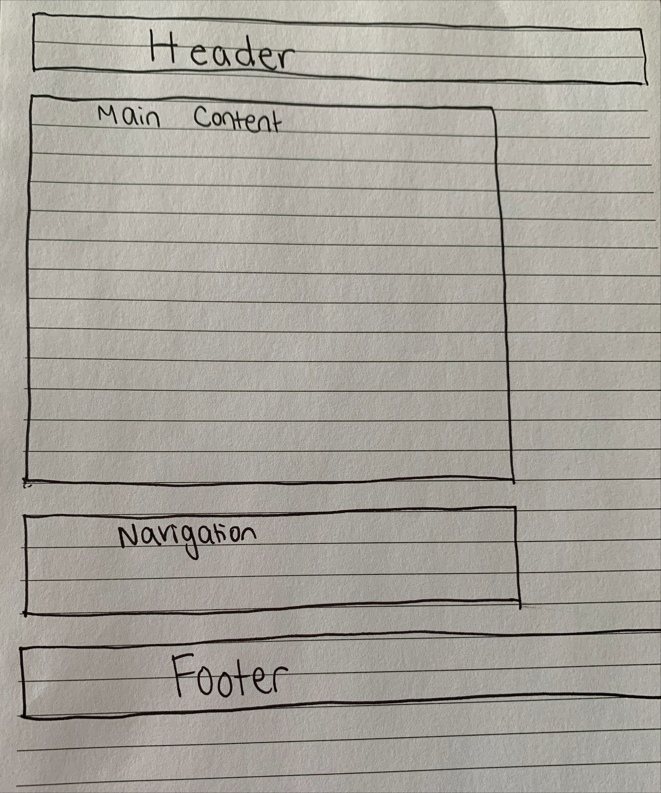
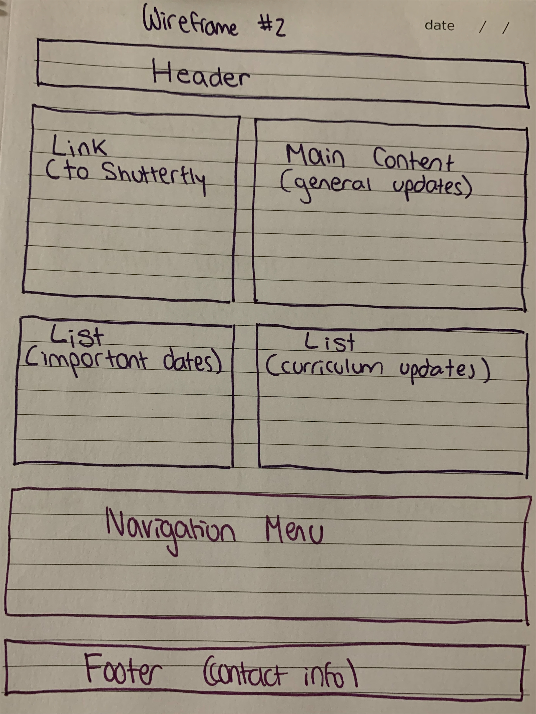
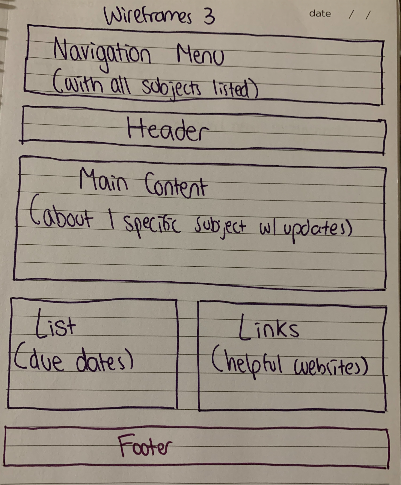

# INF 6420 - Intro to Web Development - Rachel Woelkers' INF 6420  Project

<h> My website will be made for my classroom! I am eager to create something that will be helpful to my students, their families, and myself. I have included 3 wireframes below. </h> 

## Wireframes

<h1> In order to plan out my website, here is my first sketch of a wireframe. </h1>

  

 The first one will be the main page of my website. 

 Header: The header would be Welcome to "Ms. Woelkers' Classroom". 
 

 Main Content: My main content might say some information about the school, my experience teaching, and I may change it as the year goes on to give updates. 

 Navigation Menu: I could use this to have the ability for families to click to go to other parts of the website such as contact information, class updates page, and our subject pages. 
 

 Footer: The footer would keep my email, as that is the most popular way for families to contact me. 
 

  
 

 The second wireframe will be a layout for the part of my website that would house the weekly newsletter information. This include updates in our schedule, importnat dates for our class, schoolwide events, etc. 

 Header: The header would be Woelkers' Weekly updates. 

 Main Content: The main content would house all of the general updates. If there are things students need to bring to school or other small reminders. 

 Navigation Menu: The navigation menu would give the families a chance to go to the other parts of the website like the main page, contact page, and subject pages. 

 Footer: Again, the footer would keep my email, as that is the most popular way for families to contact me. 

 Link: I saw this in the shortcuts menu. Last week, I created a shutterfly album and sent the link out to families. I thought it would be nice to include that link on the website. 

 List: I also saw this on the list of shortcuts. I thought I could use the list for two different reasons. One could be for the important dates that we have upcoming and the other could be for curriculum updates. 
 

  
 

 The third wireframe is the layout for one of the subject pages that I will have. 

 Header: The header would have the name of the subject that page is about, for example: Mathematics. 

 Navigation Menu: The navigation menu would ahve the list of all the subjects so they can easily click back and forth between them. 

 Main Content: The main content would have updates about that specific subject. For instance, if we are nearing the end of the unit, what it is about, and what the students are working to accomplish. 

 Footer: Again, the footer would keep my email, as that is the most popular way for families to contact me. 

 List: The list would have the dates of quizzes, tests, end of the unit, and anything else needed. This can help keep students organized with the dates things are due. 

 Links: Links could be for different helpful websites to learn about the topic. They could also be for the websites the students use in school so they can find them at home. 
